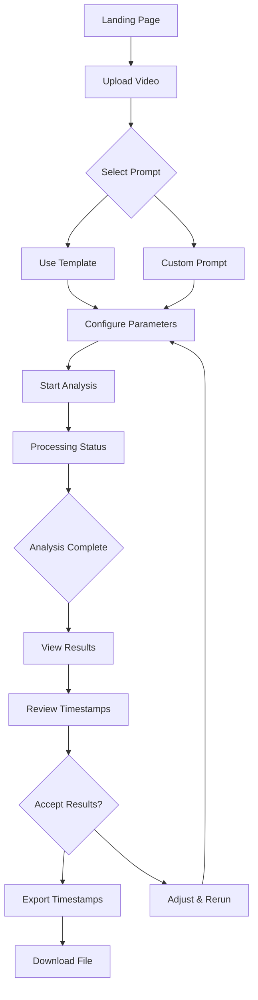

# Product Requirements Document (PRD)
## AI Video Analysis Tool - Phase 1: Gemini Integration

---

## 1. Executive Summary

### Product Overview
An internal web application that leverages Google's Gemini AI to analyze 20-minute videos and identify segments for removal, streamlining the video editing workflow by automating the initial rough cut analysis phase.

### Key Value Proposition
- **80% time reduction** in initial video review
- **Consistent editorial decisions** based on configurable criteria
- **Cost-effective** at ~$0.10 per 20-minute video analysis
- **Seamless integration** with existing editing workflows via timestamp exports

### Success Metrics
- Process 20-minute video in < 2 minutes
- Generate accurate timestamps with 95% usability rate
- Save 2+ hours of manual review time per video
- < $0.15 cost per video analysis

---

## 2. Product Specifications

### 2.1 Core Features

#### MVP Features (Phase 1)
1. **Video Upload Interface**
   - Support for MP4, MOV, AVI formats
   - File size up to 2GB
   - Upload progress indicator
   - Drag-and-drop functionality

2. **Custom Prompt Configuration**
   - Pre-built prompt templates
   - Custom prompt editor
   - Save/load prompt presets
   - Template variables (duration, style, etc.)

3. **Gemini Analysis Processing**
   - Automatic video upload to Gemini
   - Real-time processing status
   - Token usage tracking
   - Cost estimation display

4. **Timestamp Results Display**
   - Visual timeline with cut segments
   - List view of timestamps to remove
   - Confidence scores for each cut
   - Reasoning for each removal decision

5. **Export Functionality**
   - JSON format for programmatic use
   - CSV for spreadsheet analysis
   - EDL format for NLE import
   - Copy-to-clipboard for quick access

### 2.2 User Stories

#### Primary User: Video Editor
1. **As a video editor**, I want to upload a 20-minute video and get AI-powered cut recommendations so I can quickly create a rough cut.

2. **As a video editor**, I want to customize the analysis criteria (remove pauses, filler words, off-topic segments) so the AI aligns with my editorial style.

3. **As a video editor**, I want to see why each segment was marked for removal so I can make informed decisions about accepting or rejecting cuts.

4. **As a video editor**, I want to export timestamps in multiple formats so I can use them in my preferred editing software.

5. **As a video editor**, I want to see the estimated final duration after cuts so I can meet target video lengths.

#### Secondary User: Content Producer
6. **As a content producer**, I want to batch process multiple videos with the same criteria so I can maintain consistency across a series.

7. **As a content producer**, I want to track processing costs so I can manage my budget effectively.

---

## 3. Technical Architecture

### 3.1 Technology Stack

```yaml
Frontend:
  Framework: Next.js 14 (App Router)
  Language: TypeScript
  UI Library: shadcn/ui + Tailwind CSS
  State Management: Zustand
  Video Preview: video.js or native HTML5
  File Upload: react-dropzone + tus-js-client

Backend:
  Runtime: Node.js via Vercel Edge Functions
  API Routes: Next.js API Routes
  File Storage: Vercel Blob Storage (temporary)
  Database: Supabase (PostgreSQL)
  
External Services:
  AI Analysis: Google Gemini 1.5 Flash API
  Authentication: Supabase Auth
  Monitoring: Vercel Analytics
  Error Tracking: Sentry
```

### 3.2 Database Schema (Supabase)

```sql
-- Users table (managed by Supabase Auth)
-- Inherits from auth.users

-- Analysis jobs table
CREATE TABLE analysis_jobs (
  id UUID PRIMARY KEY DEFAULT gen_random_uuid(),
  user_id UUID REFERENCES auth.users(id),
  video_filename TEXT NOT NULL,
  video_duration INTEGER, -- in seconds
  video_size_mb FLOAT,
  upload_status TEXT DEFAULT 'pending', -- pending, uploading, completed, failed
  gemini_file_uri TEXT, -- Gemini's file storage URI
  analysis_status TEXT DEFAULT 'pending', -- pending, processing, completed, failed
  prompt_template TEXT,
  custom_prompt TEXT,
  gemini_response JSONB,
  timestamps_to_remove JSONB,
  processing_time_ms INTEGER,
  token_count INTEGER,
  estimated_cost DECIMAL(10, 4),
  error_message TEXT,
  created_at TIMESTAMP WITH TIME ZONE DEFAULT NOW(),
  updated_at TIMESTAMP WITH TIME ZONE DEFAULT NOW()
);

-- Prompt templates table
CREATE TABLE prompt_templates (
  id UUID PRIMARY KEY DEFAULT gen_random_uuid(),
  user_id UUID REFERENCES auth.users(id),
  name TEXT NOT NULL,
  description TEXT,
  template_text TEXT NOT NULL,
  template_variables JSONB, -- {variable_name: default_value}
  is_public BOOLEAN DEFAULT false,
  usage_count INTEGER DEFAULT 0,
  created_at TIMESTAMP WITH TIME ZONE DEFAULT NOW(),
  updated_at TIMESTAMP WITH TIME ZONE DEFAULT NOW()
);

-- Processing history for analytics
CREATE TABLE processing_history (
  id UUID PRIMARY KEY DEFAULT gen_random_uuid(),
  job_id UUID REFERENCES analysis_jobs(id),
  user_id UUID REFERENCES auth.users(id),
  video_duration INTEGER,
  segments_removed INTEGER,
  time_saved_seconds INTEGER,
  final_duration INTEGER,
  export_format TEXT,
  created_at TIMESTAMP WITH TIME ZONE DEFAULT NOW()
);

-- Indexes for performance
CREATE INDEX idx_analysis_jobs_user_id ON analysis_jobs(user_id);
CREATE INDEX idx_analysis_jobs_created_at ON analysis_jobs(created_at DESC);
CREATE INDEX idx_prompt_templates_user_id ON prompt_templates(user_id);
CREATE INDEX idx_processing_history_user_id ON processing_history(user_id);
```

### 3.3 API Design

#### Endpoints

```typescript
// 1. Upload video and start analysis
POST /api/analysis/create
Request: {
  videoFile: File,
  promptTemplate: string,
  customPrompt?: string,
  targetDuration?: number
}
Response: {
  jobId: string,
  uploadUrl: string, // Pre-signed URL for upload
  status: 'created'
}

// 2. Check analysis status
GET /api/analysis/[jobId]/status
Response: {
  jobId: string,
  status: 'uploading' | 'processing' | 'completed' | 'failed',
  progress: number, // 0-100
  currentStep: string,
  estimatedTimeRemaining?: number
}

// 3. Get analysis results
GET /api/analysis/[jobId]/results
Response: {
  jobId: string,
  videoMetadata: {
    filename: string,
    duration: number,
    size: number
  },
  analysis: {
    segmentsToRemove: Array<{
      startTime: string, // "MM:SS"
      endTime: string,
      duration: number,
      reason: string,
      confidence: number, // 0-1
      category: string // 'pause', 'filler', 'off-topic', etc.
    }>,
    summary: {
      originalDuration: number,
      finalDuration: number,
      timeRemoved: number,
      segmentCount: number
    }
  },
  cost: {
    tokens: number,
    estimatedCost: number
  }
}

// 4. Export timestamps
POST /api/analysis/[jobId]/export
Request: {
  format: 'json' | 'csv' | 'edl' | 'xml'
}
Response: {
  downloadUrl: string,
  format: string,
  filename: string
}

// 5. Prompt template management
GET /api/prompts
POST /api/prompts
PUT /api/prompts/[id]
DELETE /api/prompts/[id]
```

### 3.4 Gemini Integration Service

```typescript
// services/gemini-service.ts
interface GeminiVideoAnalyzer {
  uploadVideo(file: File): Promise<string>; // Returns Gemini file URI
  analyzeVideo(fileUri: string, prompt: string): Promise<AnalysisResult>;
  generateTimestamps(analysis: AnalysisResult): TimestampList;
  calculateTokenUsage(videoLength: number): TokenEstimate;
}

// Prompt template for removal detection
const REMOVAL_DETECTION_PROMPT = `
Analyze this video for content that should be REMOVED in a rough cut.
Focus on identifying:

1. PAUSES & DEAD AIR
   - Silence longer than 2 seconds
   - "Um", "uh", filler words with long pauses
   - Technical delays or setup time
   
2. REDUNDANT CONTENT
   - Repeated explanations
   - Restated points without new information
   - Multiple takes of the same content
   
3. OFF-TOPIC SEGMENTS
   - Tangential discussions
   - Interruptions or distractions
   - Content unrelated to main narrative

4. TECHNICAL ISSUES
   - Audio problems
   - Video glitches
   - Out-of-focus segments

For EACH segment to remove, provide:
{
  "startTime": "MM:SS",
  "endTime": "MM:SS", 
  "reason": "specific explanation",
  "category": "pause|filler|redundant|off-topic|technical",
  "confidence": 0.0-1.0
}

Target final duration: {targetDuration} minutes
Current duration: {currentDuration} minutes

Output format: JSON array of segments to remove
`;
```

### 3.5 Frontend Components

```typescript
// Component Architecture
/components
  /upload
    VideoUploader.tsx       // Drag-drop upload interface
    UploadProgress.tsx      // Progress bar with status
  /analysis
    PromptEditor.tsx        // Prompt configuration UI
    AnalysisStatus.tsx      // Real-time processing status
    Timeline.tsx            // Visual timeline of cuts
    ResultsList.tsx         // Detailed list of timestamps
  /export
    ExportDialog.tsx        // Format selection and download
    FormatSelector.tsx      // EDL, JSON, CSV options
  /templates
    TemplateManager.tsx     // CRUD for prompt templates
    TemplateCard.tsx        // Individual template display
```

---

## 4. User Interface Design

### 4.1 User Flow



### 4.2 Key Screens

#### Upload Screen
```
┌─────────────────────────────────────┐
│  AI Video Analysis Tool             │
├─────────────────────────────────────┤
│                                     │
│  ┌─────────────────────────────┐   │
│  │                             │   │
│  │   📹 Drop Video Here        │   │
│  │                             │   │
│  │   or click to browse        │   │
│  │                             │   │
│  └─────────────────────────────┘   │
│                                     │
│  Supported: MP4, MOV, AVI (max 2GB) │
│                                     │
│  ┌─────────────────────────────┐   │
│  │ Recent Analyses              │   │
│  ├─────────────────────────────┤   │
│  │ • interview_01.mp4 - 2h ago  │   │
│  │ • podcast_ep5.mov - 1d ago   │   │
│  │ • tutorial_v2.mp4 - 3d ago   │   │
│  └─────────────────────────────┘   │
└─────────────────────────────────────┘
```

#### Analysis Configuration
```
┌─────────────────────────────────────┐
│  Configure Analysis                 │
├─────────────────────────────────────┤
│  Video: interview_final.mp4         │
│  Duration: 20:34 | Size: 1.2GB      │
├─────────────────────────────────────┤
│  Prompt Template:                   │
│  ┌─────────────────────────────┐   │
│  │ ▼ Talking Head Optimizer     │   │
│  └─────────────────────────────┘   │
│                                     │
│  Target Duration: [15] minutes      │
│                                     │
│  Remove:                            │
│  ☑ Pauses > 2 seconds              │
│  ☑ Filler words ("um", "uh")       │
│  ☑ Repeated content                │
│  ☑ Off-topic segments              │
│  ☐ Technical issues only           │
│                                     │
│  Advanced Options ▼                 │
│                                     │
│  Estimated Cost: $0.12              │
│  Processing Time: ~90 seconds       │
│                                     │
│  [Cancel]        [Start Analysis]   │
└─────────────────────────────────────┘
```

#### Results Display
```
┌─────────────────────────────────────┐
│  Analysis Results                   │
├─────────────────────────────────────┤
│  Original: 20:34 → Final: 15:12     │
│  Removed: 5:22 (26.1%)              │
├─────────────────────────────────────┤
│  Timeline                           │
│  ┌─────────────────────────────┐   │
│  │███░░███░████░░░███████░░███│   │
│  └─────────────────────────────┘   │
│   0:00                      20:34   │
├─────────────────────────────────────┤
│  Segments to Remove (18 total)      │
│  ┌─────────────────────────────┐   │
│  │ 00:45-00:52 | Pause (7s)    │   │
│  │ Confidence: 95%             │   │
│  │ Long pause with "um"        │   │
│  ├─────────────────────────────┤   │
│  │ 02:15-02:43 | Redundant     │   │
│  │ Confidence: 87%             │   │
│  │ Repeated explanation         │   │
│  ├─────────────────────────────┤   │
│  │ 05:20-05:58 | Off-topic     │   │
│  │ Confidence: 78%             │   │
│  │ Tangential discussion        │   │
│  └─────────────────────────────┘   │
│                                     │
│  [Export JSON] [Export EDL] [Rerun] │
└─────────────────────────────────────┘
```

---

## 5. Implementation Plan

### 5.1 Development Phases

#### Phase 1: Foundation (Week 1)
- [ ] Set up Next.js project with TypeScript
- [ ] Configure Vercel deployment
- [ ] Set up Supabase project and auth
- [ ] Create database schema
- [ ] Implement basic UI components

#### Phase 2: Gemini Integration (Week 2)
- [ ] Implement Gemini API service
- [ ] Create video upload to Gemini
- [ ] Build prompt template system
- [ ] Implement analysis processing
- [ ] Parse and structure results

#### Phase 3: User Interface (Week 3)
- [ ] Build upload interface
- [ ] Create analysis configuration screen
- [ ] Implement results visualization
- [ ] Add timeline component
- [ ] Build export functionality

#### Phase 4: Polish & Testing (Week 4)
- [ ] Add error handling
- [ ] Implement retry logic
- [ ] Add loading states
- [ ] Create user onboarding
- [ ] Performance optimization

### 5.2 Technical Implementation Details

#### Video Upload Strategy
```typescript
// Large file upload with resumable uploads
import { tus } from 'tus-js-client';

const uploadVideo = async (file: File): Promise<string> => {
  // Step 1: Create job in database
  const job = await createAnalysisJob({
    filename: file.name,
    size: file.size,
    status: 'uploading'
  });

  // Step 2: Upload to temporary storage
  const upload = new tus.Upload(file, {
    endpoint: '/api/upload',
    resume: true,
    chunkSize: 5 * 1024 * 1024, // 5MB chunks
    metadata: {
      filename: file.name,
      filetype: file.type,
      jobId: job.id
    },
    onProgress: (bytesUploaded, bytesTotal) => {
      const percentage = (bytesUploaded / bytesTotal * 100).toFixed(2);
      updateUploadProgress(job.id, percentage);
    }
  });

  // Step 3: Start upload
  await upload.start();
  
  // Step 4: Transfer to Gemini
  const geminiUri = await transferToGemini(job.id);
  
  return geminiUri;
};
```

#### Gemini Processing Pipeline
```typescript
// Gemini analysis pipeline
const analyzeVideo = async (
  fileUri: string,
  prompt: string,
  jobId: string
): Promise<AnalysisResult> => {
  try {
    // Update status
    await updateJobStatus(jobId, 'processing');
    
    // Initialize Gemini client
    const genAI = new GoogleGenerativeAI(process.env.GEMINI_API_KEY);
    const model = genAI.getGenerativeModel({ 
      model: "gemini-1.5-flash",
      generationConfig: {
        temperature: 0.3, // Lower for consistent results
        topP: 0.8,
        topK: 40,
        maxOutputTokens: 8192,
        responseMimeType: "application/json"
      }
    });
    
    // Create file reference
    const video = {
      fileData: {
        fileUri: fileUri,
        mimeType: "video/mp4"
      }
    };
    
    // Generate content
    const result = await model.generateContent([
      video,
      { text: prompt }
    ]);
    
    // Parse response
    const response = result.response;
    const timestamps = JSON.parse(response.text());
    
    // Calculate metrics
    const metrics = calculateMetrics(timestamps);
    
    // Update database
    await updateJobResults(jobId, {
      status: 'completed',
      timestamps,
      metrics,
      tokenCount: response.usageMetadata.totalTokenCount,
      cost: calculateCost(response.usageMetadata)
    });
    
    return timestamps;
    
  } catch (error) {
    await updateJobStatus(jobId, 'failed', error.message);
    throw error;
  }
};
```

#### Export Format Generators
```typescript
// EDL Export for Premiere/FCP
const generateEDL = (timestamps: Timestamp[]): string => {
  let edl = 'TITLE: AI_Rough_Cut\n';
  edl += 'FCM: NON-DROP FRAME\n\n';
  
  let eventNum = 1;
  let recordIn = '00:00:00:00';
  
  timestamps.forEach((cut, index) => {
    // Add the kept segment before this cut
    if (index === 0 && cut.startTime !== '00:00') {
      edl += `${String(eventNum).padStart(3, '0')}  001      V     C        `;
      edl += `00:00:00:00 ${convertToTimecode(cut.startTime)} `;
      edl += `${recordIn} ${convertToTimecode(cut.startTime)}\n`;
      eventNum++;
    }
    
    // Skip the cut segment (don't include in EDL)
    // Update record in time
    recordIn = convertToTimecode(cut.endTime);
  });
  
  return edl;
};

// JSON Export
const generateJSON = (timestamps: Timestamp[]): object => {
  return {
    version: '1.0',
    created: new Date().toISOString(),
    originalDuration: timestamps[0]?.originalDuration,
    cuts: timestamps.map(t => ({
      start: t.startTime,
      end: t.endTime,
      duration: t.duration,
      reason: t.reason,
      confidence: t.confidence
    })),
    summary: {
      totalCuts: timestamps.length,
      timeRemoved: timestamps.reduce((acc, t) => acc + t.duration, 0),
      finalDuration: calculateFinalDuration(timestamps)
    }
  };
};
```

---

## 6. Security & Performance

### 6.1 Security Considerations
- **Authentication**: Supabase Auth with JWT tokens
- **API Rate Limiting**: 10 requests per minute per user
- **File Validation**: Check MIME types, file signatures
- **Secure Upload**: Pre-signed URLs with expiration
- **Data Privacy**: Videos deleted after processing
- **API Key Management**: Environment variables, never exposed

### 6.2 Performance Optimization
- **Chunked Uploads**: 5MB chunks for reliability
- **Background Processing**: Queue system for long tasks
- **Caching**: Results cached for 24 hours
- **CDN**: Static assets served via Vercel Edge
- **Database Indexing**: Optimized queries
- **Lazy Loading**: Components loaded on demand

---

## 7. Monitoring & Analytics

### 7.1 Key Metrics to Track
```typescript
interface AnalyticsMetrics {
  // Usage metrics
  dailyActiveUsers: number;
  videosProcessed: number;
  averageVideoLength: number;
  totalProcessingTime: number;
  
  // Performance metrics
  uploadSuccessRate: number;
  analysisSuccessRate: number;
  averageProcessingTime: number;
  apiResponseTime: number;
  
  // Business metrics
  totalTokensUsed: number;
  totalCost: number;
  costPerVideo: number;
  timesSavedEstimate: number;
  
  // Quality metrics
  exportUtilization: number; // % of analyses exported
  rerunRate: number; // % requiring reanalysis
  averageConfidenceScore: number;
}
```

### 7.2 Error Tracking
- Sentry integration for error monitoring
- Custom error boundaries in React
- Detailed error logging with context
- User-friendly error messages

---

## 8. Future Enhancements

### Phase 2 Considerations
1. **Batch Processing**: Multiple videos simultaneously
2. **Preset Library**: Industry-specific templates
3. **Collaborative Features**: Team sharing of templates
4. **Advanced Analytics**: Usage patterns, optimization suggestions
5. **VideoDB Integration**: Direct rough cut generation
6. **Webhook Support**: Integration with external systems
7. **Mobile App**: iOS/Android companion apps
8. **AI Model Selection**: Choose between Gemini models
9. **Custom Fine-tuning**: Train on user's editing style
10. **Real-time Preview**: Video player with cut visualization

---

## 9. Success Criteria

### Launch Metrics (Month 1)
- Successfully process 100+ videos
- Achieve < 2% error rate
- Maintain < $0.15 cost per video
- 90% of analyses complete in < 2 minutes
- 80% of results exported (high utility rate)

### Growth Metrics (Quarter 1)
- 500+ videos processed
- 5+ active daily users
- 50+ saved prompt templates
- 75% reduction in manual review time
- ROI: 10x based on time saved

---

## 10. Risks & Mitigation

| Risk | Impact | Likelihood | Mitigation |
|------|--------|------------|------------|
| Gemini API downtime | High | Low | Implement retry logic, queue system |
| Cost overruns | Medium | Medium | Set spending limits, monitor usage |
| Large file uploads fail | High | Medium | Chunked uploads, resume capability |
| Inaccurate timestamps | High | Low | Confidence scores, manual review |
| Data privacy concerns | High | Low | Clear data retention policy |

---

## Appendix A: Sample Code Structure

```
/video-analysis-app
├── /app
│   ├── /api
│   │   ├── /analysis
│   │   │   ├── create/route.ts
│   │   │   ├── [jobId]/
│   │   │   │   ├── status/route.ts
│   │   │   │   ├── results/route.ts
│   │   │   │   └── export/route.ts
│   │   ├── /prompts
│   │   │   ├── route.ts
│   │   │   └── [id]/route.ts
│   │   └── /upload/route.ts
│   ├── /dashboard
│   │   ├── layout.tsx
│   │   └── page.tsx
│   ├── /analysis
│   │   └── [jobId]/page.tsx
│   └── layout.tsx
├── /components
│   ├── /ui (shadcn components)
│   ├── /upload
│   ├── /analysis
│   └── /export
├── /lib
│   ├── /services
│   │   ├── gemini.ts
│   │   ├── supabase.ts
│   │   └── storage.ts
│   ├── /utils
│   └── /hooks
├── /types
│   └── index.ts
└── /public
```

---

## Appendix B: Environment Variables

```env
# Vercel
VERCEL_ENV=production
VERCEL_URL=https://your-app.vercel.app

# Supabase
NEXT_PUBLIC_SUPABASE_URL=https://xxx.supabase.co
NEXT_PUBLIC_SUPABASE_ANON_KEY=xxx
SUPABASE_SERVICE_KEY=xxx

# Gemini AI
GEMINI_API_KEY=xxx
GEMINI_MODEL=gemini-1.5-flash

# Storage
BLOB_READ_WRITE_TOKEN=xxx

# Monitoring
SENTRY_DSN=xxx
NEXT_PUBLIC_POSTHOG_KEY=xxx

# App Config
MAX_FILE_SIZE_MB=2000
MAX_VIDEO_DURATION_MINUTES=30
PROCESSING_TIMEOUT_SECONDS=300
```

---

*Document Version: 1.0*  
*Created: January 2025*  
*Status: Ready for Implementation*  
*Owner: Internal Tools Team*