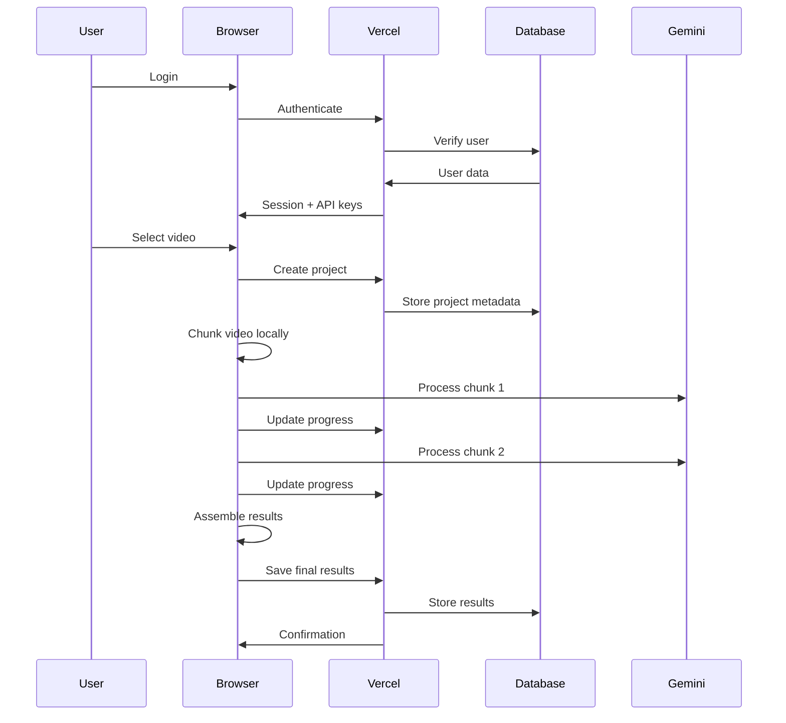

# Product Requirements Document (PRD)
## Hybrid Video Processing Platform with Client-Side Chunking

### 1. Executive Summary

This PRD outlines a hybrid video processing platform that combines cloud-hosted infrastructure (Vercel) for user management and application delivery with client-side computing resources (browser CPU/GPU) for video chunking and processing through Google's Gemini API.

### 2. Architecture Overview

```
┌─────────────────────────────────────────────────────────┐
│                   Vercel Hosting                         │
├─────────────────────────────────────────────────────────┤
│  • Next.js Application                                   │
│  • User Authentication (NextAuth/Clerk/Auth0)            │
│  • User Dashboard & Settings                             │
│  • Processing History & Results Storage                  │
│  • API Routes (user management, not video processing)    │
│  • Static Asset Delivery (CDN)                          │
└─────────────────────────────────────────────────────────┘
                           ↕
┌─────────────────────────────────────────────────────────┐
│              Client Browser (User's Machine)             │
├─────────────────────────────────────────────────────────┤
│  • Video Chunking (WebCodecs/WebWorkers)                │
│  • Local GPU/CPU Processing                              │
│  • Direct Gemini API Calls                               │
│  • Result Assembly                                       │
│  • Temporary Storage (IndexedDB)                         │
└─────────────────────────────────────────────────────────┘
```

### 3. System Components

#### 3.1 Vercel-Hosted Backend

**Core Services**
```typescript
// Server-side responsibilities
- User authentication & authorization
- Subscription/billing management
- Processing history metadata
- Result storage (metadata only, not video)
- API key management (encrypted)
- User preferences & settings
- Analytics & monitoring
- Rate limiting per user
```

**Database Schema (PostgreSQL/Prisma)**
```prisma
model User {
  id            String   @id @default(cuid())
  email         String   @unique
  name          String?
  subscription  Subscription?
  apiKeys       ApiKey[]
  projects      Project[]
  usage         Usage[]
  createdAt     DateTime @default(now())
}

model Project {
  id            String   @id @default(cuid())
  userId        String
  name          String
  status        Status   @default(PENDING)
  metadata      Json     // File info, duration, etc.
  result        Json?    // Processed result from Gemini
  chunkCount    Int?
  startedAt     DateTime?
  completedAt   DateTime?
  user          User     @relation(fields: [userId], references: [id])
}

model ApiKey {
  id            String   @id @default(cuid())
  userId        String
  encryptedKey  String   // Encrypted Gemini API key
  name          String
  lastUsed      DateTime?
  user          User     @relation(fields: [userId], references: [id])
}

model Usage {
  id            String   @id @default(cuid())
  userId        String
  projectId     String
  tokensUsed    Int
  duration      Int      // Processing duration in seconds
  date          DateTime @default(now())
  user          User     @relation(fields: [userId], references: [id])
}
```

**API Routes Structure**
```
/api/
├── auth/
│   ├── [...nextauth].ts
│   ├── session.ts
│   └── refresh.ts
├── user/
│   ├── profile.ts
│   ├── settings.ts
│   └── subscription.ts
├── projects/
│   ├── create.ts
│   ├── [id]/
│   │   ├── status.ts
│   │   ├── result.ts
│   │   └── delete.ts
│   └── list.ts
├── keys/
│   ├── add.ts
│   ├── list.ts
│   └── delete.ts
└── usage/
    ├── stats.ts
    └── history.ts
```

#### 3.2 Client-Side Processing Engine

**Browser-Based Components**
```javascript
// Client-side responsibilities
class VideoProcessor {
  constructor(config) {
    this.userId = config.userId;
    this.projectId = config.projectId;
    this.geminiKey = config.geminiKey; // Decrypted client-side
    this.chunkSize = config.chunkSize;
  }

  async processVideo(file) {
    // 1. Initialize project on server
    await this.initializeProject(file.name, file.size);
    
    // 2. Chunk video locally
    const chunks = await this.chunkVideo(file);
    
    // 3. Process each chunk with Gemini
    const results = await this.processChunks(chunks);
    
    // 4. Assemble results
    const finalResult = await this.assembleResults(results);
    
    // 5. Save results to server
    await this.saveResults(finalResult);
    
    return finalResult;
  }

  async chunkVideo(file) {
    // Uses WebCodecs API
    // Runs on user's GPU/CPU
    // Never uploads video to server
  }

  async processChunks(chunks) {
    // Direct calls to Gemini API
    // Progress updates to server
    // Retry logic
  }
}
```

### 4. User Authentication & Management

#### 4.1 Authentication Flow

**NextAuth.js Configuration**
```javascript
// Multiple auth providers
- Email/Password
- Google OAuth
- GitHub OAuth
- Magic Link

// Session management
- JWT tokens
- Refresh tokens
- Session persistence
```

**User Roles & Permissions**
```typescript
enum UserRole {
  FREE = "FREE",           // 5 videos/month, 10min max
  STARTER = "STARTER",     // 50 videos/month, 30min max
  PRO = "PRO",            // 500 videos/month, 2hr max
  ENTERPRISE = "ENTERPRISE" // Unlimited, custom limits
}

interface Permissions {
  maxVideosPerMonth: number;
  maxVideoDuration: number; // in minutes
  maxConcurrentProjects: number;
  priorityProcessing: boolean;
  customBranding: boolean;
  apiAccess: boolean;
}
```

### 5. Hybrid Processing Workflow

#### 5.1 Complete User Journey



#### 5.2 State Management

**Server-Side State**
```javascript
// Stored in PostgreSQL
{
  projectId: "uuid",
  userId: "uuid",
  status: "initializing|chunking|processing|completed|failed",
  progress: {
    totalChunks: 10,
    processedChunks: 5,
    currentChunk: 6,
    estimatedTimeRemaining: 300 // seconds
  },
  metadata: {
    fileName: "video.mp4",
    fileSize: 1073741824, // bytes
    duration: 3600, // seconds
    startedAt: "2025-01-12T10:00:00Z"
  }
}
```

**Client-Side State**
```javascript
// Stored in IndexedDB + React Context
{
  chunks: [
    {
      index: 0,
      blob: Blob,
      status: "pending|processing|completed|failed",
      result: null,
      retries: 0
    }
  ],
  geminiResponses: [],
  uploadProgress: 0.5,
  processingProgress: 0.3,
  errors: []
}
```

### 6. Security Architecture

#### 6.1 API Key Management

**Secure Storage Flow**
```javascript
// Server-side encryption
const encryptApiKey = (key) => {
  return encrypt(key, process.env.ENCRYPTION_KEY);
};

// Client-side usage
const getApiKey = async () => {
  const response = await fetch('/api/keys/decrypt', {
    method: 'POST',
    headers: { 'Authorization': `Bearer ${session.token}` }
  });
  const { key } = await response.json();
  return key; // Temporarily in memory
};
```

**Security Measures**
- API keys encrypted at rest
- Keys transmitted over HTTPS only
- Keys never logged or exposed in UI
- Automatic key rotation available
- Per-user rate limiting

### 7. Deployment Configuration

#### 7.1 Vercel Setup

**vercel.json**
```json
{
  "functions": {
    "api/projects/create.ts": {
      "maxDuration": 10
    },
    "api/projects/[id]/status.ts": {
      "maxDuration": 5
    }
  },
  "env": {
    "DATABASE_URL": "@database_url",
    "NEXTAUTH_SECRET": "@nextauth_secret",
    "ENCRYPTION_KEY": "@encryption_key"
  }
}
```

**Environment Variables**
```env
# Authentication
NEXTAUTH_URL=https://app.videoprocessor.com
NEXTAUTH_SECRET=xxx
GOOGLE_CLIENT_ID=xxx
GOOGLE_CLIENT_SECRET=xxx

# Database
DATABASE_URL=postgresql://...

# Security
ENCRYPTION_KEY=xxx
ALLOWED_ORIGINS=https://app.videoprocessor.com

# Analytics
POSTHOG_KEY=xxx
SENTRY_DSN=xxx
```

### 8. Client-Side Requirements

#### 8.1 Browser Capabilities

**Progressive Enhancement**
```javascript
const checkBrowserSupport = () => {
  const support = {
    webCodecs: 'VideoDecoder' in window,
    webGL: !!document.createElement('canvas').getContext('webgl2'),
    webWorkers: 'Worker' in window,
    indexedDB: 'indexedDB' in window,
    serviceWorker: 'serviceWorker' in navigator
  };
  
  if (!support.webCodecs) {
    // Fallback to FFmpeg.wasm
  }
  if (!support.webGL) {
    // CPU-only processing
  }
  
  return support;
};
```

### 9. Monitoring & Analytics

#### 9.1 Server-Side Monitoring

**Vercel Analytics**
- API route performance
- User session tracking
- Error rates
- Geographic distribution

**Custom Metrics**
```javascript
// Track in PostgreSQL
await prisma.analytics.create({
  data: {
    event: 'video_processed',
    userId: user.id,
    metadata: {
      duration: video.duration,
      chunks: chunkCount,
      processingTime: endTime - startTime,
      browserInfo: userAgent
    }
  }
});
```

#### 9.2 Client-Side Monitoring

**Performance Tracking**
```javascript
// Send to server for aggregation
const metrics = {
  chunkingTime: performance.measure('chunking'),
  apiCallTime: performance.measure('api-calls'),
  assemblyTime: performance.measure('assembly'),
  memoryUsed: performance.memory?.usedJSHeapSize,
  fps: calculateFPS()
};

await fetch('/api/analytics/performance', {
  method: 'POST',
  body: JSON.stringify(metrics)
});
```

### 10. Pricing & Billing

#### 10.1 Subscription Tiers

**Stripe Integration**
```javascript
// Subscription management
const plans = {
  free: {
    price: 0,
    videos: 5,
    duration: 10, // minutes
    features: ['basic_processing']
  },
  starter: {
    price: 9.99,
    videos: 50,
    duration: 30,
    features: ['basic_processing', 'priority_queue', 'export_formats']
  },
  pro: {
    price: 49.99,
    videos: 500,
    duration: 120,
    features: ['all_features', 'api_access', 'custom_prompts']
  }
};
```

### 11. Advantages of Hybrid Approach

#### 11.1 Benefits

**For Users:**
- No video upload time (processing starts immediately)
- Privacy (videos never leave their device)
- No storage costs passed on
- Faster processing (no upload bottleneck)

**For Platform:**
- Minimal infrastructure costs (no video storage)
- Reduced bandwidth costs
- Scalable (processing scales with users)
- Lower liability (no content storage)

**Technical Benefits:**
- Leverages client hardware
- Reduces server load
- Better error isolation
- Progressive enhancement possible

### 12. Failure Scenarios & Recovery

#### 12.1 Handling Interruptions

**Browser/Tab Closure**
```javascript
// Before closure - save state
window.addEventListener('beforeunload', async (e) => {
  if (isProcessing) {
    await saveStateToServer();
    e.returnValue = 'Processing in progress...';
  }
});

// On return - restore state
const resumeProcessing = async () => {
  const state = await fetchStateFromServer();
  const localState = await getFromIndexedDB();
  
  // Merge and continue from last successful chunk
  const resumePoint = Math.max(
    state.lastProcessedChunk,
    localState.lastProcessedChunk
  );
  
  continueFromChunk(resumePoint + 1);
};
```

### 13. Development Roadmap

#### Phase 1: Foundation (Week 1-2)
- Vercel deployment setup
- NextAuth integration
- Basic user dashboard
- Database schema implementation

#### Phase 2: Core Processing (Week 3-4)
- Client-side chunking engine
- Gemini API integration
- Progress tracking system
- Result storage

#### Phase 3: User Experience (Week 5-6)
- Responsive UI design
- Real-time progress updates
- Error handling & recovery
- File management interface

#### Phase 4: Premium Features (Week 7-8)
- Stripe billing integration
- Usage tracking & limits
- API key management UI
- Advanced processing options

#### Phase 5: Optimization (Week 9-10)
- Performance improvements
- Cross-browser testing
- Security audit
- Documentation

### 14. Tech Stack Summary

**Frontend:**
- Next.js 14 (App Router)
- React 18
- Tailwind CSS
- Shadcn/ui components
- Zustand (state management)
- React Query (data fetching)

**Backend (Vercel):**
- Next.js API Routes
- Prisma ORM
- PostgreSQL (Vercel Postgres)
- NextAuth.js
- Stripe SDK

**Client-Side Processing:**
- WebCodecs API
- Web Workers
- IndexedDB (via Dexie.js)
- FFmpeg.wasm (fallback)

**External Services:**
- Google Gemini API
- Stripe (payments)
- PostHog (analytics)
- Sentry (error tracking)
- Vercel (hosting)

---

**Document Version:** 2.0  
**Last Updated:** 2025-01-12  
**Status:** Final Draft